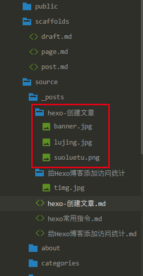

hexo 文章的创建及markdown语法
<!--more-->

## hexo 创建文章
命令行输入：
``` bash
$ hexo new "new article"
```

之后在source/_posts目录下面，多了一个new-article.md的文件。
打开后：
``` bash
---
title: new article
date: 2018-09-28 20:10:33
tags:
---

```
文件的开头是属性，采用统一的yaml格式，用三条短横线分隔。下面是文章正文， 文章的正文支持markdown格式。
**新建、删除或修改文章后，不需要重启hexo server，刷新一下即可预览。**


***

### 属性
	文章可以拥有如下属性：

|  Setting   |        Description        |    Default     |
|------------|---------------------------|----------------|
| layout     | layout                    | post或page     |
| title      | 文章标题                  | 文件名         |
| date       | 创建日期                  | 文件的创建日期 |
| updated    | 修改日期                  | 文件的修改日期 |
| comments   | 是否开启评论              | true           |
| tags       | 标签                      | NULL           |
| categories | 分类                      | NULL           |
| permalink  | url中的名字               | 文件名         |
| thumbnail  | 文章缩略图                | NULL           |
| banner     | 文章缩略图&文章首部banner | NULL           |

***

### 分类和标签

	分类只有一个，但标签可以有多个且有两种写法如下：

``` bash
---
...
categories: "工具"
tags:
    - hexo
    - markdown
    - 前端
# 或者
# tags: [hexo, markdown, 前端]
---
```
***

## 文章缩略图和banner
**注： 不同主题设置可能不同，本部分只针icarus主题， 其他主题仅供参考**
当只设置 banner 时，文章的缩略图 和 banner 将都是 banner 所设置的图片；
当只设置 thumbnail 时， 文章只有缩略图，无banner
当同时设置 banner 和 thumbnail 时，banner 为 banner图，thumbnail 为缩略图， 两者各自生效；

	设置图片前要在当前文章所在目录新建一个同名文件夹，用于存放图片等静态文件，如图；

	或者修改配置文件\_config.yml
``` bash
post_asset_folder: true # 创建时生成静态资源文件夹
```
此时创建新文章时会自动在同级目录下生成同名文件夹用于存放静态文件，不同的主题可通过 thumbnail 和 banner 两个属性来设置缩略图和banner

### 文章缩略图设置：

``` bash
---
...
thumbnail: https://...        # 此处为图片地址
---
```

***

### 文章banner设置：

``` bash
---
...
banner: https://...           # 此处为图片地址
---
```
***注： 若引用本地图片时，需要加上路径前缀，如下图：***


	
	则引用路径为：
``` bash
banner: /bolg/2018/09/27/hexo-创建文章/banner.jpg
```

***

## MarkDown 语法

### 斜体和粗体
``` bash
*这是斜体* 或 _这也是斜体_ 
**这是粗体**
***这是加粗斜体***
~~这是删除线~~
```

	效果
*这是斜体* 或 _这也是斜体_ 
**这是粗体**
***这是加粗斜体***
~~这是删除线~~

***

### 分级标题
``` bash
# 一级标题
## 二级标题
### 三级标题
#### 四级标题
##### 五级标题
###### 六级标题
```

<!-- 	效果
# 一级标题
## 二级标题
### 三级标题
#### 四级标题
##### 五级标题
###### 六级标题 -->

***

### 超链接
``` bash
行内形式：[我的博客](https://zhangjichengcc.github.io/bolg/)
参考形式：[我的博客][1]，有一个很好的平台-[GitHub][2]
[1]:https://kevinpu.github.io/
[2]:http://www.jianshu.com/
自动链接：我的博客地址<https://zhangjichengcc.github.io/bolg/>
```
	
	效果
行内形式：[我的博客](https://zhangjichengcc.github.io/bolg/)
参考形式：[我的博客][1]，有一个很好的平台-[GitHub][2]
[1]:https://zhangjichengcc.github.io/bolg/
[2]:https://zhangjichengcc.github.io/
自动链接：我的博客地址<https://zhangjichengcc.github.io/bolg/>


***

### 列表
#### 无序列表：
``` bash
* 无序列表项1
+ 无序列表项2
- 无序列表项3
```

	效果
* 无序列表项1
+ 无序列表项2
- 无序列表项3

#### 有序列表
``` bash
1.有序列表项1
2.有序列表项2
3.有序列表项3
```

	效果
1.有序列表项1
2.有序列表项2
3.有序列表项3

***

### 插入图片
``` bash

```

***

### 表格
``` bash
| 表头1|表头2|表头3|表头4
|-| :- | :-: | -: |
|默认左对齐|左对齐|居中对齐|右对齐|
|默认左对齐|左对齐|居中对齐|右对齐|
|默认左对齐|左对齐|居中对齐|右对齐|
```

	效果
| 表头1|表头2|表头3|表头4
|-| :- | :-: | -: |
|默认左对齐|左对齐|居中对齐|右对齐|
|默认左对齐|左对齐|居中对齐|右对齐|
|默认左对齐|左对齐|居中对齐|右对齐|

***

### code
``` bash
``` bash
...code 主体
```

	效果
``` bash
...code 主体
```

### 引用
``` bash
>这是引用
这是引用
这是引用
>>不！我才是引用
```
	效果

>这是引用
这是引用
这是引用
>>不！我才是引用