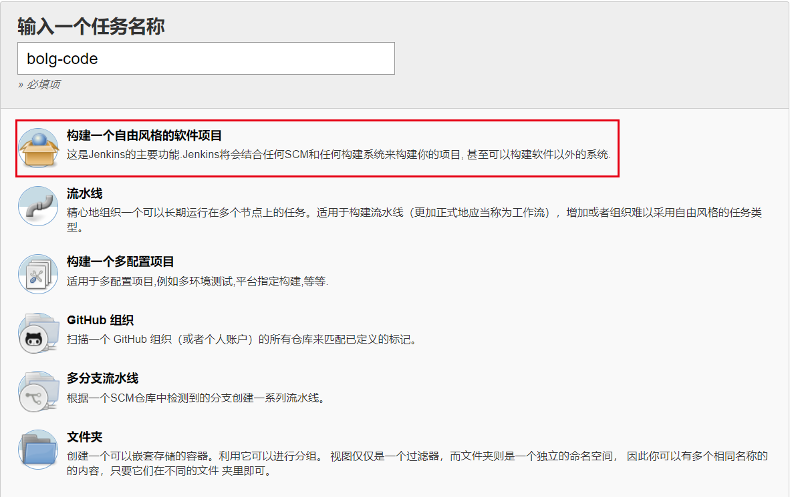

>Jenkins是一个开源软件项目，是基于Java开发的一种持续集成工具，用于监控持续重复的工作，旨在提供一个开放易用的软件平台，使软件的持续集成变成可能。

<!-- more -->

###部署方式

jenkins的构建方式常用分为三种。

**jenkins触发式构建：**push代码或者合并代码到项目的master或者其他分支，jenkins就部署代码到对应服务器。

**jenkins参数化构建：**push代码或者合并代码到项目的master或者其他分支之后，并不会部署代码，而是需要登录到jenkins的web界面，点击构建按钮，传入对应的参数（比如参数需要构建的tag，需要部署的分支）然后才会部署。

**jenkins定时构建：**多用于APP、自动化用例等自动打包，定时构建是在参数化构建的基础上添加的，开发人员可以登录jenkins手动传入tag进行打包，如果不手动打包，那么jenkins就定时从配置项目地址拉取最新的代码打包。

### 安装java环境

#### 下载JDK
首先我们需要下载java开发工具包JDK，下载地址：
[http://www.oracle.com/technetwork/java/javase/downloads/index.html](http://www.oracle.com/technetwork/java/javase/downloads/index.html)，
下载对应版本：

下载后JDK的安装根据提示进行，还有安装JDK的时候也会安装JRE，一并安装就可以了。

#### 配置环境变量
1.安装完成后，右击"我的电脑"，点击"属性"，选择"高级系统设置"；

2.选择"高级"选项卡，点击"环境变量"；

3.添加环境变量

在"系统变量"中设置3项属性，JAVA_HOME,PATH,CLASSPATH(大小写无所谓),若已存在则点击"编辑"，不存在则点击"新建"。

变量设置参数如下：

|  变量名   |                                   变量值                                   |
|-----------|----------------------------------------------------------------------------|
| JAVA_HOME | C:\Program Files (x86)\Java\jdk1.8.0_91        // 要根据自己的实际路径配置 |
| CLASSPATH | .;%JAVA_HOME%\lib\dt.jar;%JAVA_HOME%\lib\tools.jar;                        |
| Path      | %JAVA_HOME%\bin;%JAVA_HOME%\jre\bin;                                       |

#### 测试JDK是否安装成功

进入cmd，键入命令: java -version、java、javac 几个命令进行验证

### jenkins安装

### jenkins配置
安装完成后，访问 http://你的服务器ip:8080/ 即可

安装好 Jenkins 后，第一次访问会让你输入密码，页面上会提示具体是哪个文件，用 vim 打开即可查看，比如 CentOS 默认是：/var/lib/jenkins/secrets/initialAdminPassword。
　　进入后，可以创建新的用户，以后就可以使用这个用户访问 Jenkins 了。
　　新建账号后，会提示安装插件，一般直接按推荐安装，如果有报错，最好点击重试，多试几次一般都会安装成功，如果实在装不上那就先跳过吧

#### 新建任务，输入任务名，选择自由风格即可：
新建任务，输入任务名，选择自由风格即可：

选择github项目，项目url填写自己博客页面的url
